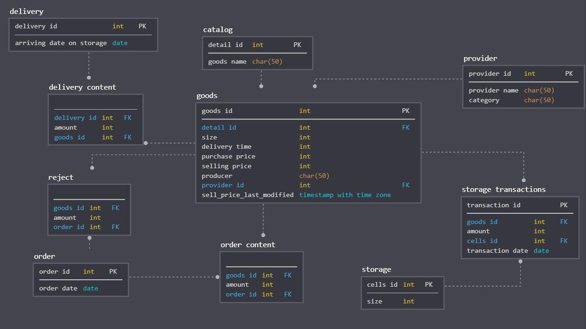
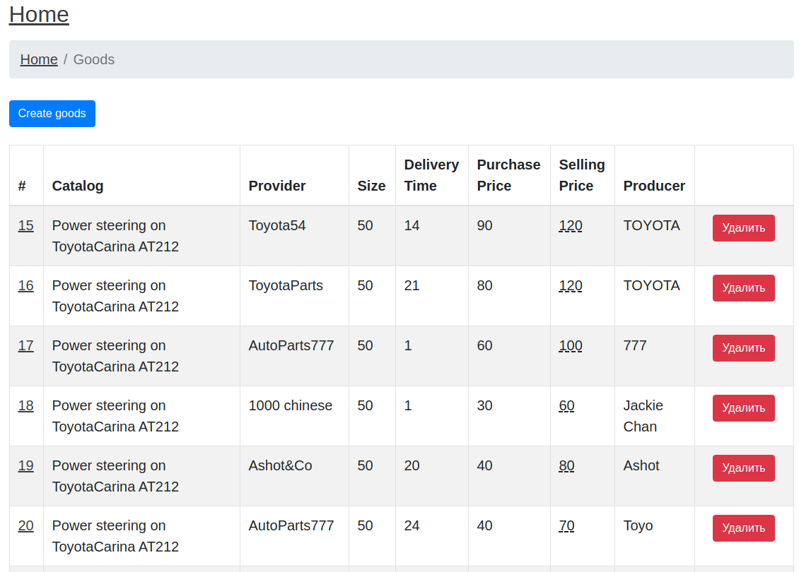

# Проект "Информационная система магазина автозапчастей"

[Описание задачи](./docs/Project.md)

## Установка

1. Склонировать проект с Github.
2. Открыть проект в Idea.
3. Запустить [Application.java](./src/main/java/DataBase/Application.java)
4. Из [webapp](./webapp/) запустить
`docker build -t autoshop-webapp .`
5. Запустить webapp командой `docker run --name autoshop-webapp --rm -d --network=host autoshop-webapp`
6. Открыть webapp по адресу `http://localhost:3000`

Бэкенд приложения запустится на порту 8080 и проинициализирует схему и содержание БД. Фронтенд приложения запустится на порту 3000 и будет ожидать, что бэкенд работает на порту 8080.

### Схема БД

### Наполнение БД

Миграции работают на FlyWay, скрипты миграций лежат в [resources/db/migration](./src/main/resources/db/migration/).
- V1__Init_DB.sql инициализирует схему БД;
- V2__Init_sequences.sql добавляет PostgreSQL sequences для PK таблиц.
- V3__Create_stored_procedure.sql добавляет хранимую процедуру для запроса 12.
- V4__Create_selling_price_last_modified.sql добавляет поле `goods.selling_price_last_modified` и триггер для обновления этого поля, когда `goods.selling_price` редактируется.

### Формы ввода данных.

На главной странице слева есть секция «CRUD», там перечень страниц для прямого просмотра и наполнения БД.

Пример - страница `Goods`:

Кнопкой `Create goods` можно перейти к форме создания нового товара, по клику на `Id` можно перейти к редактированию товара из списка, кнопка `Удалить` удалит соответствующую строчку.

На странице `Goods` так же можно посмотреть `goods.selling_price_last_modified`, если навести на колонку `Selling price`.

### "Идеальные" формы

На главной странице справа сверху есть секция «"Идеальные" формы», там ссылки на страницы соответствующих форм.

#### 1. "Идеальная" форма ввода - добавление доставки.

Форма добавляет сразу доставку и её содержание, т.е. в таблицы `delivery` и `delivery_content` соответственно. Для добаления новой позиции в список надо нажать `Добавить позицию`. Добавленные позиции можно удалить.
- Связанная сущность Товар выбирается из списка.
- Для примера сделана валидация количества товара (на бэкенде). Для каждой позиции доставки она происходит отдельно и сообщение выводится рядом с количеством невалидной позиции.
- Необходимые поля помечены как required в форме, поэтому браузер сам проверяет их на заполненность (валидация на клиенте).
- Сохранение формы происходит одним запросом, на бэкенде сначала сохраняется доставка `delivery`, а потом зависимые от неё позиции доставки `delivery_content`. Так как позиции - это список, то они сохраняются через `JpaReposiry.saveAll(Iterable)`, т.е. через пакетную вставку.
- Можно добавить товар, если его нет в списке, после добавления товара будет автоматический редирект обратно в эту форму, заполненные поля останутся заполненными. Список товаров обновится и можно выбрать свежесозданный товар.
- На бэкенде соответствующий метод `DeliveryController` обернут в `@Transactional`, что означает, что создание `delivery` и `delivery_content` происходит в одной транзакции.

#### 2. "Идеальная" форма вывода - средние продажи по месяцам (запрос №6).

В форме вывода присутствуют фильтры по всем полям таблицы, сортировка по всем полям таблицы и пагинация.

- Деталь - фильтр по конкретной сущности, сортировка по её названию, `detailId` / `goodsName` соответственно
- Месяц - фильтр и сортировка по месяцу
- Производитель - фильтр по текстовому полю, используется case-insensitive поиск по подстроке, есть сортировка
- Количество от / количество до - парный фильтр для колонки количество (результат агрегации), есть сортировка по этому значению

### Формы вывода запросов

На главной странице справа снизу есть секция «Запросы», там список страниц с формами вывода соответствующих запросов. Запросы 9 и 14 отсутствуют, потому что мы заранее договорились, что на согласованной схеме БД их не получится реализовать.

#### Интересные моменты

- Реализация запроса №12 (кассовый отчет) сделана через хранимую процедуру.
- В разных запросах есть разные типы фильтров - по подстроке, по дате, по промежутку дат, по сущности (выбор из списка).
